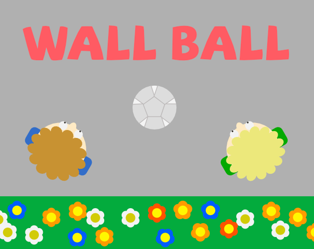
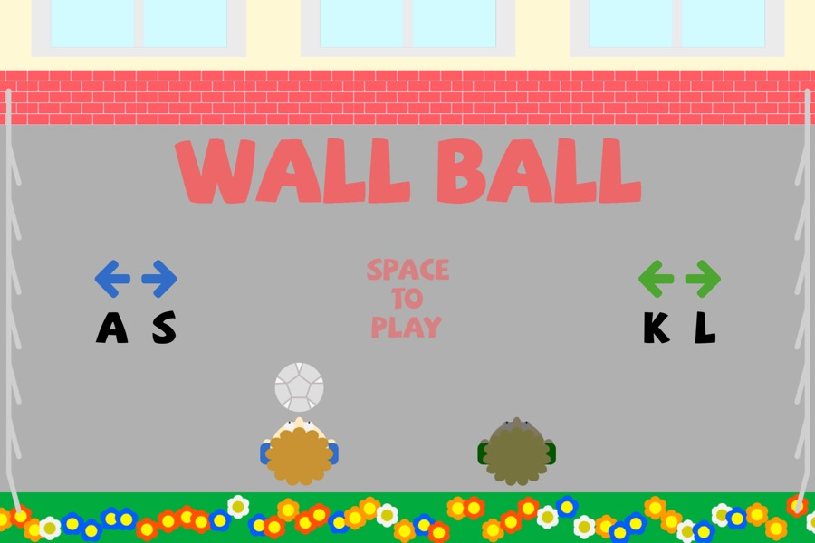
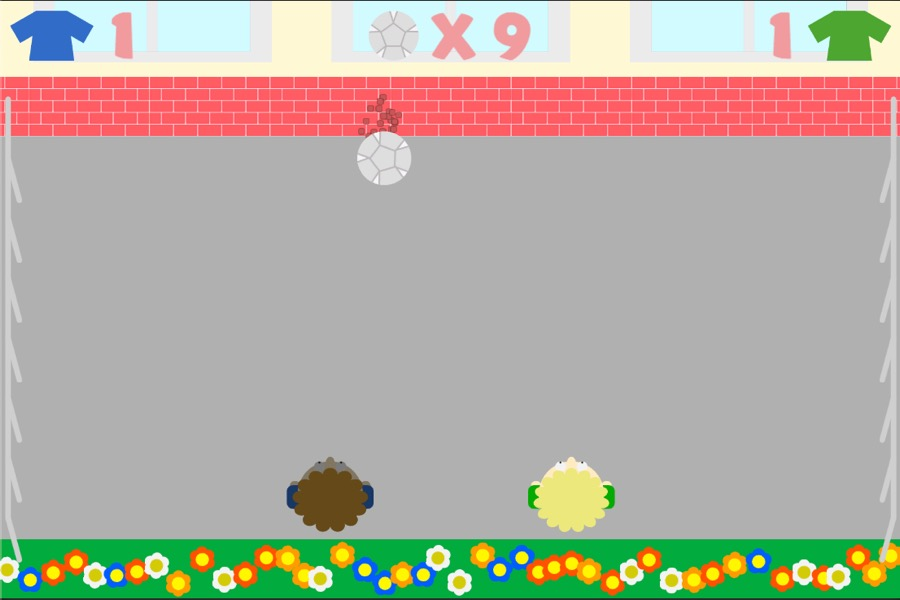
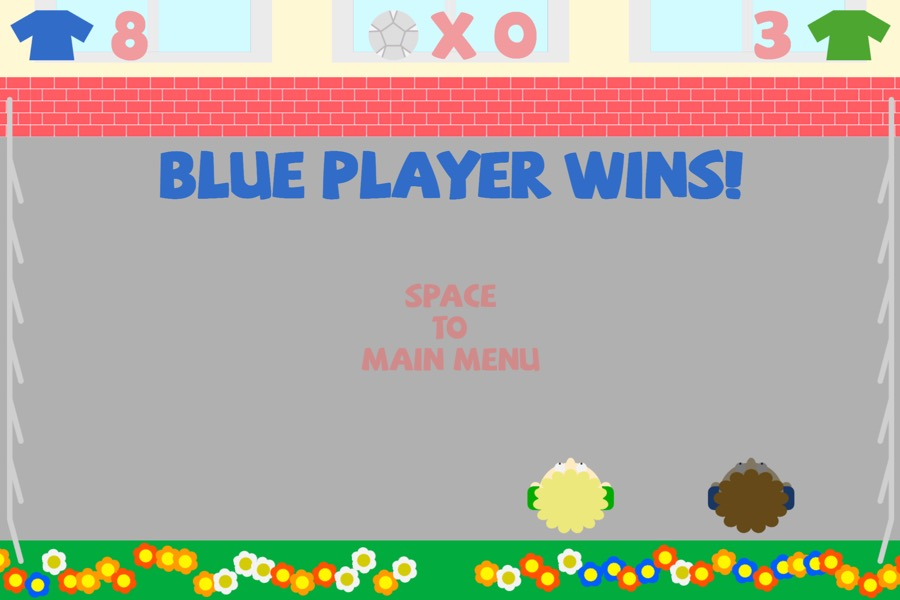

# Wall Ball

A simple pixel art arcade game made for [Bratislava Game Jam](https://itch.io/jam/bratislava-game-jam-session-stay-home-edition).  
The game can be played in the browser on [pixelook.itch.io/wall-ball](https://pixelook.itch.io/wall-ball).  
Only local multiplayer is supported.

## Used tools
[Affinity Designer](https://affinity.serif.com/en-gb/designer/) - for drawing  
[Bfxr](http://bfxr.net/), [ocenaudio](https://www.ocenaudio.com) - for SFX and sounds  
[ecrettmusic](http://ecrettmusic.com/)​- for the music  
[Unity3d](https://unity.com) - hmm...

## Pictures

### Cover

### From game

